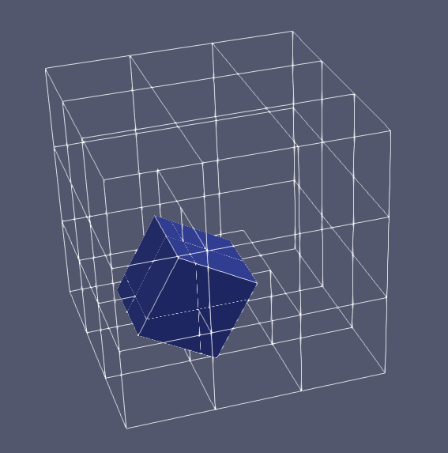
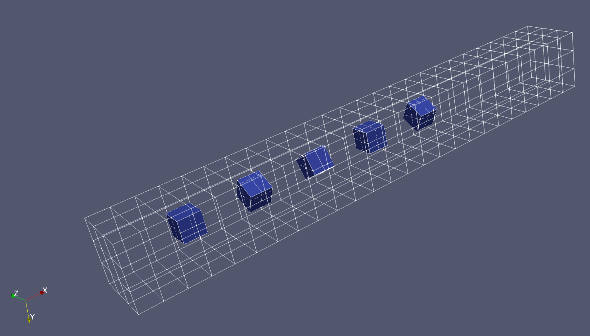

# OpenFOAM
My custom OpenFOAM to couple turbulence with sediment transport.

This repository have been forked from OpenFOAM 2312 version released by OpenCFD Ltd.

Works in Progress:

    Geometry Manipulation to account sediment particles and their movement.

